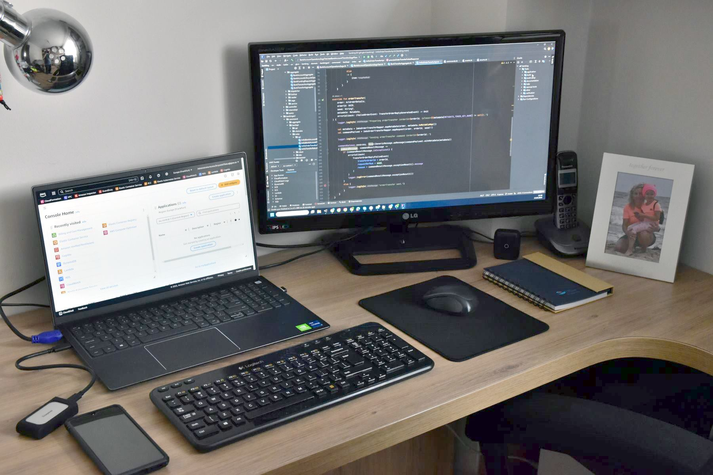
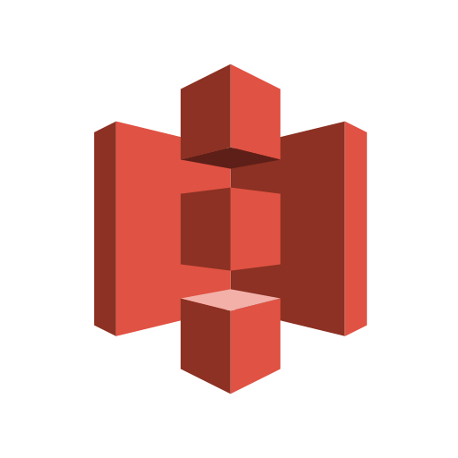
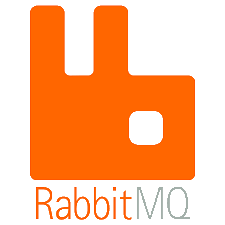
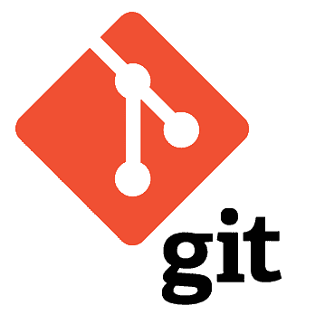
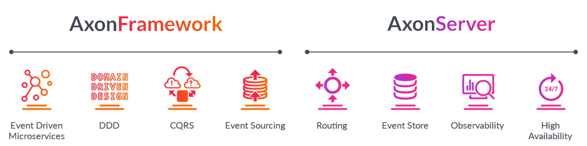

# Hi, I'm Krzysztof Flakus

I'm an experienced Software Engineer and Engineering Lead with nearly 20 years of expertise in designing and building scalable, reliable web applications, primarily focused on the backend, with strong expertise in Kotlin, Java, Spring Boot, Axon Framework, and PostgreSQL. Experienced in AWS services &#40;Cognito, AVP, ECS, Lambda, DynamoDB&#41; and leadership roles as a Team Lead and Engineering Manager.

 

## Professional Experience

